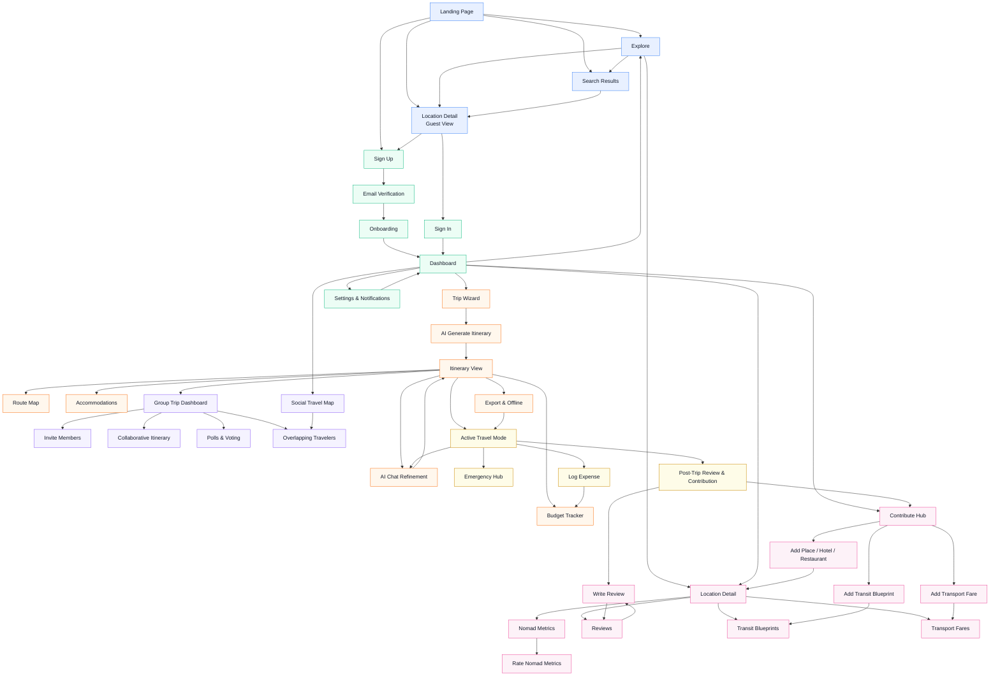

# BanglaTrek — Complete App Flow

> This document describes the full user journey across every feature of BanglaTrek.
> It is organized as: a master page inventory, followed by named user flows that
> trace every path a user can take through the product. Use this as the source of
> truth for page design and navigation architecture.

## Overall App Flow Diagram



---

## 0. Auth States

Every page in the app exists in one of three states:

| State | Who | Access |
|---|---|---|
| **Guest** | Not logged in | Public pages only |
| **Authenticated** | Logged in, onboarding complete | All protected pages |
| **Onboarding** | Logged in, onboarding incomplete | Only the onboarding wizard |

---

## 1. Master Page Inventory

### 1.1 Public Pages (Guest + Authenticated)

| # | Page | Route |
|---|---|---|
| P-01 | Landing Page | `/` |
| P-02 | Explore / Discover | `/explore` |
| P-03 | Location Detail Page | `/place/:slug` |
| P-04 | Search Results | `/search?q=...` |
| P-05 | About / How It Works | `/about` |

### 1.2 Auth Pages

| # | Page | Route |
|---|---|---|
| A-01 | Sign Up | `/signup` |
| A-02 | Sign In | `/login` |
| A-03 | Email Verification Pending | `/verify-email` |
| A-04 | Email Verified Confirmation | `/email-confirmed` |
| A-05 | Forgot Password | `/forgot-password` |
| A-06 | Reset Password | `/reset-password?token=...` |

### 1.3 Onboarding Pages (Authenticated, incomplete profile)

| # | Page | Route |
|---|---|---|
| O-01 | Step 1 — Basic Info | `/onboarding/profile` |
| O-02 | Step 2 — Travel Preferences | `/onboarding/preferences` |
| O-03 | Step 3 — Interests | `/onboarding/interests` |
| O-04 | Step 4 — Group Type | `/onboarding/group-type` |
| O-05 | Onboarding Complete | `/onboarding/done` |

### 1.4 Core App Pages (Authenticated)

| # | Page | Route |
|---|---|---|
| C-01 | Dashboard / Home | `/dashboard` |
| C-02 | Notifications Center | `/notifications` |
| C-03 | Profile Page | `/profile/:username` |
| C-04 | Account Settings | `/settings` |
| C-05 | Notification Preferences | `/settings/notifications` |

### 1.5 Trip Planning Pages

| # | Page | Route |
|---|---|---|
| T-01 | My Trips | `/trips` |
| T-02 | New Trip Wizard — Step 1: Destination | `/trips/new/destination` |
| T-03 | New Trip Wizard — Step 2: Details | `/trips/new/details` |
| T-04 | New Trip Wizard — Step 3: Preferences | `/trips/new/preferences` |
| T-05 | AI Itinerary Generating (loading) | `/trips/new/generating` |
| T-06 | Itinerary View | `/trips/:tripId` |
| T-07 | Itinerary Day Detail | `/trips/:tripId/day/:dayNum` |
| T-08 | AI Chat Refinement | `/trips/:tripId/chat` |
| T-09 | Trip Route Map | `/trips/:tripId/route` |
| T-10 | Trip Accommodations | `/trips/:tripId/accommodations` |
| T-11 | Accommodation Detail | `/trips/:tripId/accommodations/:hotelId` |
| T-12 | Trip Budget | `/trips/:tripId/budget` |
| T-13 | Log Expense | `/trips/:tripId/budget/log` |
| T-14 | Trip Export | `/trips/:tripId/export` |

### 1.6 Group Trip Pages

| # | Page | Route |
|---|---|---|
| G-01 | Group Trip Dashboard | `/trips/:tripId/group` |
| G-02 | Invite Members | `/trips/:tripId/group/invite` |
| G-03 | Invite Accept (link) | `/join/:inviteCode` |
| G-04 | Group Member List | `/trips/:tripId/group/members` |
| G-05 | Collaborative Itinerary | `/trips/:tripId/group/itinerary` |
| G-06 | Voting / Polls | `/trips/:tripId/group/polls` |
| G-07 | Create Poll | `/trips/:tripId/group/polls/new` |
| G-08 | Overlapping Travelers | `/trips/:tripId/group/nearby-travelers` |

### 1.7 Community Contribution Pages

| # | Page | Route |
|---|---|---|
| CC-01 | Contribute Hub | `/contribute` |
| CC-02 | Add New Location | `/contribute/location/new` |
| CC-03 | Add Hotel / Guesthouse / Homestay | `/contribute/accommodation/new` |
| CC-04 | Add Restaurant | `/contribute/restaurant/new` |
| CC-05 | Add Transit Blueprint | `/contribute/transit-blueprint/new` |
| CC-06 | Add Transport Fare | `/contribute/transport-fare/new` |
| CC-07 | Edit Existing Contribution | `/contribute/:type/:id/edit` |
| CC-08 | My Contributions | `/contribute/mine` |

### 1.8 Location / Nomad Metrics Pages

| # | Page | Route |
|---|---|---|
| L-01 | Location Detail (same as P-03 authenticated) | `/place/:slug` |
| L-02 | Rate Nomad Metrics | `/place/:slug/nomad-metrics/rate` |
| L-03 | Full Nomad Metrics Dashboard | `/place/:slug/nomad-metrics` |
| L-04 | All Photos & Videos | `/place/:slug/media` |

### 1.9 Social Map & Discovery

| # | Page | Route |
|---|---|---|
| SM-01 | Social Travel Map | `/map` |
| SM-02 | Traveler Profile (from map) | `/profile/:username` |

### 1.10 Emergency Pages

| # | Page | Route |
|---|---|---|
| E-01 | Emergency Hub | `/emergency` |
| E-02 | Nearest Facilities Map | `/emergency/map` |
| E-03 | Emergency Phrases | `/emergency/phrases` |

### 1.11 Review Pages

| # | Page | Route |
|---|---|---|
| R-01 | Write Review | `/place/:slug/review/new` |
| R-02 | My Reviews | `/profile/:username/reviews` |
| R-03 | All Reviews for Location | `/place/:slug/reviews` |

---

## 2. Global Navigation Structure

```
Top Navigation Bar (authenticated):
  Logo → /dashboard
  Explore → /explore
  Map → /map
  My Trips → /trips
  Contribute → /contribute
  Emergency → /emergency
  [Notifications Bell] → /notifications
  [Avatar Menu]:
    My Profile → /profile/:username
    My Trips → /trips
    My Contributions → /contribute/mine
    My Reviews → /profile/:username/reviews
    Settings → /settings
    Sign Out → /login

Bottom Navigation (mobile, authenticated):
  Home | Explore | Trips | Map | More(...)
```

---

## 3. Flow 1 — Guest Discovery (No Account)

**Goal:** A visitor lands on the site, explores destinations, and is nudged to sign up.

```
[P-01] Landing Page
  │
  ├── Hero Section
  │     CTA "Start Planning" → [A-01] Sign Up
  │     CTA "Explore Bangladesh" → [P-02] Explore
  │     Search Bar (destination) → [P-04] Search Results
  │
  ├── Featured Destinations (Trending & Hidden Gems)
  │     Click a card → [P-03] Location Detail Page (guest view)
  │
  ├── "How It Works" Section (scroll)
  │     CTA "Get Started Free" → [A-01] Sign Up
  │
  ├── Community Stats strip (users, trips, locations)
  │
  └── Sample Itinerary Preview (blurred/teaser)
        CTA "Unlock Full Itinerary" → [A-01] Sign Up

[P-02] Explore Page (Guest)
  │
  ├── Filter Bar: Category (Attraction/Hotel/Restaurant), Tags
  │   (Trending / Hidden Gem), District, Budget Range
  ├── Location Grid / List (all public entries)
  ├── Click any card → [P-03] Location Detail Page
  └── "Plan a Trip" CTA (sticky) → [A-01] Sign Up

[P-04] Search Results
  │
  ├── Results list with type (place, hotel, restaurant)
  ├── Filter sidebar
  └── Click result → [P-03] Location Detail Page

[P-03] Location Detail Page (Guest View)
  │
  ├── Hero photo + name + district
  ├── Tags: Trending / Hidden Gem
  ├── Photo gallery (Cloudinary images)
  ├── Embedded Videos (YouTube/Facebook/TikTok)
  ├── Brief Description
  ├── Nomad Metrics Preview (read-only, blurred scores)
  │     CTA "See Full Metrics" → [A-01] Sign Up
  ├── Reviews Preview (first 2)
  │     CTA "Read All Reviews" → [A-01] Sign Up
  └── "Add to Trip" / "Plan a Trip Here" CTA → [A-01] Sign Up
```

---

## 4. Flow 2 — Authentication

### 4.1 Sign Up

```
[A-01] Sign Up Page
  │
  ├── Form: Full Name, Email, Password, Confirm Password
  ├── "Sign up with Google" OAuth option
  ├── Agree to Terms checkbox
  ├── Already have account? → [A-02] Sign In
  │
  └── Submit
        ├── Success → [A-03] Email Verification Pending
        └── Error (email taken, weak password) → inline error

[A-03] Email Verification Pending
  │
  ├── "Check your inbox" message
  ├── Resend verification email button
  └── User clicks link in email
        └── → [A-04] Email Verified Confirmation
              └── Auto-redirect after 2s → [O-01] Onboarding Step 1
```

### 4.2 Sign In

```
[A-02] Sign In Page
  │
  ├── Form: Email, Password
  ├── "Sign in with Google" OAuth
  ├── Forgot Password? → [A-05] Forgot Password
  ├── No account? → [A-01] Sign Up
  │
  └── Submit
        ├── Success + onboarding complete → [C-01] Dashboard
        ├── Success + onboarding incomplete → [O-01] Onboarding Step 1
        └── Error → inline error
```

### 4.3 Password Reset

```
[A-05] Forgot Password
  │
  ├── Form: Email
  └── Submit → confirmation message "Reset link sent"
        └── User clicks link in email → [A-06] Reset Password

[A-06] Reset Password
  │
  ├── Form: New Password, Confirm Password (token in URL)
  └── Submit
        ├── Success → toast + redirect → [A-02] Sign In
        └── Invalid/expired token → error + link back to [A-05]
```

---

## 5. Flow 3 — Onboarding (First-Time Setup)

**Triggered automatically after first email verification or first Google login.**

```
[O-01] Step 1 — Basic Info
  │   Form: Display Name, Avatar upload (Cloudinary), Bio (optional),
  │         Home city
  └── Next → [O-02]

[O-02] Step 2 — Travel Preferences
  │   Multi-select: Budget Traveler / Backpacker / Mid-range /
  │                 Luxury / Adventure / Family / Solo
  └── Next → [O-03]

[O-03] Step 3 — Interests
  │   Multi-select chips: Nature, History, Food, Culture, Beaches,
  │                        Hill Tracts, Urban, Wildlife, Photography,
  │                        Remote/Off-grid
  └── Next → [O-04]

[O-04] Step 4 — Group Type
  │   Single choice: Solo / Couple / Friends Group / Family /
  │                  Digital Nomad
  └── Finish → [O-05]

[O-05] Onboarding Complete
  │   Celebration screen: "Welcome to BanglaTrek!"
  │   Quick-start options:
  │     "Plan My First Trip" → [T-02] New Trip Wizard
  │     "Explore Places" → [P-02] Explore
  └── Auto-redirect after 4s → [C-01] Dashboard
```

---

## 6. Flow 4 — Dashboard (Home Base)

```
[C-01] Dashboard
  │
  ├── Section: "Continue Planning" (in-progress trips)
  │     Click trip card → [T-06] Itinerary View
  │
  ├── Section: "Your Upcoming Trips" (saved/confirmed)
  │     Click trip card → [T-06] Itinerary View
  │
  ├── Section: "Discover" — Trending & Hidden Gem cards
  │     Click → [P-03] Location Detail
  │
  ├── Section: "Friends on the Move" (social map preview)
  │     "View Full Map" → [SM-01] Social Travel Map
  │
  ├── Section: "Seasonal Intelligence Banner"
  │     (Monsoon warning / best season callout based on profile)
  │     Click → [T-02] New Trip Wizard (pre-filled)
  │
  ├── FAB (Floating Action Button): "Plan a Trip"
  │     → [T-02] New Trip Wizard
  │
  └── Notification badges on bell icon
        → [C-02] Notifications Center
```

---

## 7. Flow 5 — AI Itinerary Creation

### 7.1 New Trip Wizard

```
[T-02] Step 1 — Destination
  │   Search bar (typeahead with known locations from DB)
  │   Map pin selection (Bari Koi API map)
  │   Multi-destination toggle
  └── Next → [T-03]

[T-03] Step 2 — Trip Details
  │   Form:
  │     Start Date / End Date (calendar picker)
  │     Travel Duration (auto-calculated)
  │     Total Budget (BDT slider + manual input)
  │     Group Type (pre-filled from profile, editable)
  │     Number of travelers
  └── Next → [T-04]

[T-04] Step 3 — Preferences
  │   Travel Style: Budget / Mid-range / Luxury
  │   Interests: (same chips as onboarding, re-selectable)
  │   Priority: Nature-heavy / Culture-heavy / Balanced /
  │              Mostly Food / Adventure
  │   Accommodation Type: Hotel / Guesthouse / Homestay / Any
  │   Special notes (text field): e.g., "vegetarian only",
  │                                 "avoid hills due to health"
  └── Generate → [T-05]

[T-05] AI Generating Screen
  │   Animated progress:
  │     "Analyzing community data..."
  │     "Finding hidden gems near you..."
  │     "Calculating optimal routes..."
  │     "Building your hour-by-hour schedule..."
  │   (LLM API call running in background)
  └── Complete → [T-06] Itinerary View
```

### 7.2 Itinerary View

```
[T-06] Itinerary View
  │
  ├── Trip Header: Title, Destination, Dates, Budget, Group Type
  │
  ├── Tab Bar:
  │     Overview | Days | Route | Accommodations | Budget | Export
  │
  ├── Overview Tab:
  │     AI summary paragraph
  │     Total estimated cost breakdown (pie chart)
  │     Highlights (top 3 attractions)
  │     Cultural insights callout box
  │     Monsoon/seasonal warning banner (if applicable)
  │
  ├── Days Tab:
  │     Day cards (D1, D2, ...) — click to expand or go to detail
  │     → [T-07] Day Detail
  │
  ├── Route Tab → [T-09] Route Map
  ├── Accommodations Tab → [T-10] Accommodations
  ├── Budget Tab → [T-12] Budget
  ├── Export Tab → [T-14] Export
  │
  ├── "Refine with AI" button (sticky bottom) → [T-08] AI Chat
  │
  └── "Share / Make Group Trip" button
        → [G-01] Group Trip Dashboard (new or existing group)

[T-07] Itinerary Day Detail
  │
  ├── Timeline view (hourly slots):
  │     08:00 — Breakfast at [Restaurant Name]
  │             ↳ Estimated cost, tips, map pin
  │     10:00 — Visit [Attraction Name]
  │             ↳ Description, duration, cultural insight
  │             ↳ "Hidden Gem" or "Trending" badge
  │             ↳ Link → [P-03] Location Detail
  │     ...and so on
  │
  ├── Day summary: Total estimated cost, total distance
  ├── Edit slots: drag-reorder, remove activity, add activity
  │     Add Activity search → [P-02] Explore (with add-to-day CTA)
  └── Back → [T-06] Itinerary View (Days tab)
```

---

## 8. Flow 6 — AI Chat Refinement

```
[T-08] AI Chat Refinement
  │
  ├── Chat interface (conversational, streaming responses)
  │     User types:
  │       "Add more nature spots on day 2"
  │       "Make the whole trip under 5000 taka"
  │       "Replace the hotel with homestays"
  │       "I want more free evenings"
  │
  ├── AI responds with:
  │     Proposed changes in markdown
  │     "Apply these changes?" [Yes / No / Modify further]
  │
  ├── On "Yes":
  │     Itinerary updates in real-time
  │     → [T-06] Itinerary View (updated)
  │
  ├── Seasonal Intelligence chip suggestions:
  │     "⚠ Monsoon risk in October — want to reschedule?"
  │     "🌤 Best time for Cox's Bazar is Nov–Feb"
  │
  └── "Done" → [T-06] Itinerary View
```

---

## 9. Flow 7 — Location Pages & Nomad Metrics

### 9.1 Location Detail (Authenticated)

```
[L-01] Location Detail Page (Authenticated)
  │
  ├── Hero: Large photo, location name, district, coordinates
  │
  ├── Tags: Trending / Hidden Gem
  │
  ├── Tab Bar:
  │     Overview | Photos & Videos | Nomad Metrics | Reviews |
  │     Transport | Transit Blueprints
  │
  ├── Overview Tab:
  │     Description, best time to visit, tips from community
  │     "Add to Trip" button → trip selector modal
  │     "Get Directions" → [T-09] Route Map (pre-filled)
  │
  ├── Photos & Videos Tab → [L-04] All Media
  │     Photo grid (Cloudinary)
  │     Embedded video player (YouTube/Facebook/TikTok URL)
  │     "Upload Photo" → file picker → Cloudinary upload
  │     "Embed Video" → URL input modal
  │
  ├── Nomad Metrics Tab → [L-03] Full Nomad Metrics
  │
  ├── Reviews Tab → [R-03] All Reviews
  │     "Write a Review" → [R-01] Write Review
  │
  ├── Transport Tab:
  │     Fare estimates table (crowdsourced)
  │     Modes: CNG / Bus / Train / Rickshaw
  │     External booking links: Shohoz, Rail e-ticketing
  │     "Add/Update Fare" → [CC-06] Add Transport Fare
  │
  └── Transit Blueprints Tab:
        Community-written routes (e.g., "Take Dhaka–Comilla bus...")
        "Add a Blueprint" → [CC-05] Add Transit Blueprint
```

### 9.2 Nomad Metrics

```
[L-03] Full Nomad Metrics Dashboard
  │
  ├── Interactive map (Bari Koi API)
  │     Heatmap overlays by metric type
  │     Toggle layers:
  │       Network (GP / Robi / Banglalink / Teletalk — per carrier)
  │       Solo-Female Safety Rating
  │       bKash / Nagad Digital Payment Availability
  │       Road Condition
  │
  ├── Score cards per metric (0–5 scale, community average)
  │     - GP Signal: 3.2/5 (42 ratings)
  │     - Robi Signal: 1.8/5 (38 ratings)
  │     - Solo-Female Safety: 4.1/5 (27 ratings)
  │     - bKash Availability: 2.9/5 (55 ratings)
  │
  ├── "Rate This Location" CTA
  │     → [L-02] Rate Nomad Metrics
  │
  └── Historical trend (last 6 months line chart)

[L-02] Rate Nomad Metrics
  │
  ├── Sliders / star inputs for each metric:
  │     Network Carrier ratings (one per carrier)
  │     Solo-Female Safety (1–5)
  │     bKash / Nagad Availability (1–5)
  │     Road Condition (1–5)
  │
  ├── Optional comment field
  ├── "I visited on" date picker
  └── Submit → back to [L-03] with updated scores (optimistic UI)
```

---

## 10. Flow 8 — Community Contribution

```
[CC-01] Contribute Hub
  │
  ├── My Contributions summary stats
  ├── Contribution type cards:
  │     "Add a Place" → [CC-02]
  │     "Add Accommodation" → [CC-03]
  │     "Add Restaurant / Food Spot" → [CC-04]
  │     "Write a Transit Blueprint" → [CC-05]
  │     "Submit Transport Fare" → [CC-06]
  │
  └── "My Submissions" tab → [CC-08]

[CC-02] Add New Location (Attraction / Landmark / Nature Spot)
  │
  ├── Form:
  │     Name, District, Division
  │     GPS Coordinates (map pin picker — Bari Koi API)
  │     Category (Waterfall / Beach / Forest / Historical / etc.)
  │     Description (rich text)
  │     Price Range: Free / Budget / Mid-range / Premium
  │     Tips (text)
  │     Tag: Hidden Gem / Trending (user suggests, system confirms)
  │     Amenities checklist (toilet, parking, food nearby, etc.)
  │
  ├── Photo Upload: multiple files → Cloudinary API
  │     Progress bars per file
  │
  ├── Video Section:
  │     "Embed a vlogger's reel" URL input (YouTube/FB/TikTok)
  │     Preview thumbnail
  │
  └── Submit → Review confirmation screen
        "Your contribution is live!" → [L-01] Location Detail

[CC-03] Add Accommodation
  │   Same form pattern as CC-02 plus:
  │     Type: Hotel / Guesthouse / Homestay / Resort
  │     Price per night (BDT)
  │     Room types available
  │     Amenities: WiFi, AC, Hot Water, Generator, etc.
  │     Contact / Booking info
  └── Submit → [L-01] Location Detail

[CC-04] Add Restaurant / Food Spot
  │   Same form plus:
  │     Cuisine type
  │     Meal price range
  │     Halal / Vegetarian options flag
  └── Submit → [L-01] Location Detail

[CC-05] Add Transit Blueprint
  │
  ├── Origin + Destination (searchable)
  ├── Step-by-step directions (dynamic text fields):
  │     Step 1: [e.g., "Take Dhaka-bound Shyamoli bus from..."]
  │     Step 2: [add step button]
  │     ...
  ├── Estimated time, estimated cost
  ├── Notes (road conditions, seasonal changes)
  └── Submit → confirmation + LLM parses and indexes blueprint

[CC-06] Add Transport Fare
  │
  ├── Origin, Destination, Mode (CNG / Bus / Train / Launch)
  ├── Fare (BDT), Fare type (per seat / per vehicle)
  ├── As of date
  └── Submit → fare immediately available in Transport tab

[CC-08] My Contributions
  │
  ├── List of all submitted items with status (Live / Under Review)
  ├── Edit button → [CC-07] Edit Contribution
  └── View on map button → [L-01] Location Detail
```

---

## 11. Flow 9 — Group Trips & Social Planning

### 11.1 Creating and Managing a Group Trip

```
[G-01] Group Trip Dashboard
  │
  ├── Entry points:
  │     From [T-06] "Share / Make Group Trip" button
  │     From [T-01] My Trips → "Create Group Trip"
  │
  ├── Trip header (same as itinerary)
  ├── Members panel (avatars + roles: Admin / Member)
  │
  ├── Tab Bar:
  │     Overview | Itinerary | Polls | Members | Nearby Travelers
  │
  ├── "Invite Members" CTA → [G-02]
  │
  └── Real-time presence indicators (who's viewing now)

[G-02] Invite Members
  │
  ├── Share link (auto-generated shareable URL → [G-03])
  │     Copy link / Share via WhatsApp
  ├── Invite by username/email search
  │     → sends in-app + email notification to invitee
  └── Back → [G-01]

[G-03] Invite Accept Page (landing from invite link)
  │
  ├── If guest → [A-01] Sign Up (with redirect back to [G-03])
  ├── If authenticated → show trip preview + "Join Trip" button
  └── Join → [G-01] Group Trip Dashboard
            (notification sent to group admin)

[G-04] Member List
  │
  ├── Member cards: avatar, name, travel style
  ├── Admin: remove member, change role
  └── Click member → [C-03] Their Profile
```

### 11.2 Collaborative Planning

```
[G-05] Collaborative Itinerary
  │
  ├── Shared itinerary view (same as [T-06] Days tab)
  ├── Real-time edits visible to all members (WebSocket)
  │     Change indicator: "Ahmed edited Day 2 — 2 min ago"
  │
  ├── Suggestion mode:
  │     Any member can "suggest" an activity swap
  │     Suggestions show as pending cards (yellow highlight)
  │     Admin or majority vote approves/rejects
  │
  └── "Create a Poll" CTA → [G-07]

[G-06] Polls Dashboard
  │
  ├── List of active and closed polls
  │     Examples: "Which hotel?", "Day 3 morning activity?"
  ├── Click poll → inline voting UI (radio/checkbox)
  ├── Live vote count (updates in real-time)
  ├── Poll result notification sent via Messaging API (email/in-app)
  └── "Create New Poll" → [G-07]

[G-07] Create Poll
  │
  ├── Question text field
  ├── Options: add up to 6 (can attach a location/hotel card)
  ├── Deadline picker
  └── Publish → [G-06] Polls Dashboard
                + Messaging API push to all members

[G-08] Overlapping Travelers
  │
  ├── Shows other platform users (not in this group) planning the
  │   same destination during overlapping dates
  ├── Filter: "Open to meetup" toggle
  ├── Traveler cards: avatar, travel style, interests overlap %
  ├── "Say Hello" → in-app message (opens DM or connect modal)
  └── Opt-out toggle: "Don't show me in others' lists"
```

---

## 12. Flow 10 — Accommodation Planning

```
[T-10] Trip Accommodations Page
  │
  ├── AI Recommendation Strip:
  │     "Based on your attractions, these 3 locations minimize
  │      your daily travel distances:" (LLM reasoning shown)
  │
  ├── Filter Bar:
  │     Type (Hotel / Guesthouse / Homestay)
  │     Budget per night (slider)
  │     Amenities (WiFi, AC, etc.)
  │     Distance from Day 1 attraction
  │
  ├── Accommodation cards:
  │     Photo (Cloudinary), name, type, price/night, rating,
  │     distance from itinerary, amenities icons
  │     "View Details" → [T-11]
  │     "Add to Trip" → adds to relevant day in itinerary
  │
  └── "Add New Accommodation" → [CC-03] Contribute

[T-11] Accommodation Detail
  │
  ├── Full photo gallery
  ├── Description, amenities list, price range
  ├── Location on Bari Koi map
  ├── Community reviews for this accommodation
  ├── "Add to My Trip" → day selector → updates itinerary
  └── Contact info (phone / booking link if available)
```

---

## 13. Flow 11 — Route Optimization & Transit Blueprints

```
[T-09] Trip Route Map
  │
  ├── Interactive map (Bari Koi API)
  │     All itinerary pins plotted (colour-coded by day)
  │     Daily routes drawn as lines
  │     Geographic clustering: nearby attractions grouped
  │
  ├── Day selector tabs: Day 1 | Day 2 | ...
  │     Route auto-redraws per day
  │
  ├── Travel Mode selector:
  │     Walking / Cycling / Rickshaw / CNG / Bus / Mixed
  │
  ├── Estimated travel time between each stop
  │
  ├── Route fallback indicator:
  │     "Standard route unavailable — using Transit Blueprint"
  │     (when Bari Koi API has no data for this area)
  │     Displays community-written steps instead of drawn line
  │
  ├── Transport Cost Strip:
  │     Per-leg fare estimate (from crowdsourced data)
  │     Total transport cost for the day
  │     "Add Manual Fare" → [CC-06] Add Transport Fare
  │
  └── "View Transit Blueprints" → Location Detail Transit tab
```

---

## 14. Flow 12 — Budget Management

```
[T-12] Trip Budget Page
  │
  ├── Budget Setup (first visit):
  │     Total budget input (BDT) — pre-filled from trip wizard
  │     Per-category allocation sliders:
  │       Accommodation / Food / Transport / Attractions / Misc
  │     "Save Budget" → activates tracker
  │
  ├── Tracker Dashboard (after setup):
  │     Progress ring: X spent / Y total budget
  │     Category breakdown bar chart
  │     "You've used 80% of your budget" warning banner
  │       (triggered at 80% — Messaging API email + in-app alert)
  │     "Budget exceeded" critical banner (at 100%)
  │
  ├── Expense List:
  │     Sorted by date, filterable by category
  │     Each entry: amount, category icon, note, date
  │     Swipe / click to delete or edit
  │
  ├── "Log Expense" FAB → [T-13]
  │
  └── Export summary → included in [T-14] PDF Export

[T-13] Log Expense
  │
  ├── Form:
  │     Amount (BDT)
  │     Category: Accommodation / Food / Transport /
  │               Attraction Entry / Shopping / Misc
  │     Note (optional text)
  │     Date + Time (defaults to now)
  │     Location tag (optional — links to a place)
  │
  └── Save → back to [T-12] Budget (totals update instantly)
```

---

## 15. Flow 13 — During Active Travel

**This is the mobile-first "travel mode" experience once a trip start date arrives.**

```
[C-01] Dashboard — "Active Trip" Banner
  │
  └── "Your trip to [Destination] starts today!" banner
        CTA "Open Travel Mode" → [T-06] Itinerary View
              (today's day is auto-expanded)

[T-07] Day Detail (during travel)
  │
  ├── "Current" indicator on active time slot
  ├── Quick actions strip:
  │     "Log Expense" → [T-13]
  │     "Emergency" → [E-01]
  │     "Open Map" → [T-09] (current location centered)
  │     "AI Help" → [T-08] Chat
  │
  ├── Each activity card:
  │     "I'm here" check-in button
  │       → marks as visited, prompts quick rating
  │     "Get Directions" → native maps deep link
  │     "Call" (if phone number available)
  │
  └── Bottom bar:
        Budget used today | Total remaining | Log button
```

---

## 16. Flow 14 — Emergency Resources

```
[E-01] Emergency Hub
  │
  ├── Entry points:
  │     Top nav "Emergency" link (always visible)
  │     Quick-action from Day Detail during travel
  │     Offline accessible (data pre-cached in export)
  │
  ├── Section: "Nearest Facilities"
  │     Based on current GPS location
  │     Types: Hospital / Police Station / Tourist Police
  │     "View on Map" → [E-02]
  │
  ├── Section: "Emergency Contacts"
  │     National Emergency: 999
  │     Tourist Police Hotline: 01769-690669
  │     Fire Service: 199
  │
  ├── Section: "Emergency Phrases" → [E-03]
  │
  └── Section: "AI Dialect Translator"
        Type your emergency need in English
        LLM translates into Bengali + local dialect
        Output shown as large readable text + audio (TTS)

[E-02] Nearest Facilities Map
  │
  ├── Bari Koi API map centered on user's GPS
  ├── Pins: Hospital (red cross) / Police (blue) /
  │         Tourist Police (green)
  ├── Distance + estimated travel time to each
  ├── Click pin → info card with address, phone number
  └── "Get Directions" → native maps deep link

[E-03] Emergency Phrases
  │
  ├── Phrase categories:
  │     Medical / Lost / Theft / Accident / Help Needed
  ├── Each phrase shown in:
  │     English | Bengali (Bangla script) | Romanized Bengali
  ├── Text-to-speech button per phrase
  ├── "Add Custom Phrase" → text field →
  │     LLM translates + adds to personal phrase list
  └── All phrases available offline (cached on first load)
```

---

## 17. Flow 15 — Post-Trip Reviews

```
[R-01] Write Review Page
  │
  ├── Entry points:
  │     From [L-01] Location Detail → Reviews tab
  │     From [T-01] My Trips → completed trip → "Leave Reviews"
  │     Email reminder (Messaging API, 1 day after trip end)
  │
  ├── Form:
  │     Star rating (1–5) — overall
  │     Sub-ratings: Value for Money / Accessibility /
  │                  Cleanliness / Crowd Level
  │     Written review (rich text, min 50 chars)
  │
  ├── Photos section:
  │     Upload multiple photos → Cloudinary API
  │     Progress indicator per file
  │
  ├── Actual Cost Log:
  │     "How much did you actually spend here?" (BDT)
  │     Time spent (hours)
  │     These override AI estimates for future users
  │
  ├── Travel Tips (text field):
  │     "Best tip for future travelers"
  │     Travel Style tag: Budget / Luxury / Adventure / Family
  │
  └── Submit → [R-03] All Reviews (review live immediately)
              + contributes actual cost data to location

[R-03] All Reviews for a Location
  │
  ├── Aggregate score + breakdown bars
  ├── Filter: Travel Style / Rating / Most Recent / Most Helpful
  ├── Review cards:
  │     Avatar, name, travel style badge, date, star rating,
  │     review text, photos (Cloudinary lightbox),
  │     actual cost logged, time spent
  │     "Helpful" upvote button
  └── "Write Your Review" CTA → [R-01]
```

---

## 18. Flow 16 — Social Travel Map

```
[SM-01] Social Travel Map
  │
  ├── Full-screen Bari Koi API map
  │
  ├── Pins / clusters:
  │     Green: Users currently traveling here (real-time)
  │     Blue: Users planning to visit (future dates)
  │     Purple: You (own position / planned destinations)
  │
  ├── Filter Panel (collapsible):
  │     Date range slider
  │     Travel style match (show only similar travelers)
  │     "Open to meetup" only toggle
  │     Friends only toggle
  │
  ├── Click on a cluster → expands to traveler cards:
  │     Avatar, name, travel dates, interests overlap %
  │     "View Profile" → [C-03] Profile
  │     "Say Hello" → connect request / DM modal
  │
  ├── My Planned Trips shown as route overlays
  │
  └── Privacy note: users control visibility in [C-04] Settings
        Options: Public / Friends Only / Hidden
```

---

## 19. Flow 17 — Export & Offline Access

```
[T-14] Export Page
  │
  ├── Entry: from [T-06] Itinerary View → Export tab
  │
  ├── Preview panel:
  │     Shows what will be included in the export
  │
  ├── PDF Export section:
  │     "Generate PDF" button
  │     PDF includes:
  │       - Full hour-by-hour itinerary (all days)
  │       - Accommodation details
  │       - Transport cost estimates per leg
  │       - Community Transit Blueprints (for off-grid legs)
  │       - Nomad Metrics scores for each location
  │       - Emergency contacts + nearest facilities
  │       - Emergency phrases (Bengali + English)
  │       - Budget summary
  │       - Maps: static snapshot of daily routes
  │     Loading state: "Generating your PDF..." spinner
  │     Success → download triggered automatically
  │
  ├── Offline Map section:
  │     "Download Offline Maps" button
  │     Shows area coverage (bounding box on mini-map)
  │     Download size estimate shown before confirming
  │     Progress bar during tile download
  │     Success: "Maps saved — accessible without internet"
  │
  ├── Offline Data Bundle:
  │     All location data, Nomad Metrics, Transit Blueprints,
  │     emergency resources, and phrases cached to device
  │     "Last synced" timestamp
  │     "Re-sync" button
  │
  └── Share option: send PDF via WhatsApp / Email / Copy Link
```

---

## 20. Flow 18 — Notifications & Settings

### 20.1 Notifications Center

```
[C-02] Notifications Center
  │
  ├── Filter tabs: All | Trips | Social | System
  │
  ├── Notification types:
  │     🗺  "Your trip to Sylhet starts in 3 days" (daily reminder)
  │     👥  "Ahmed joined your group trip to Sundarbans"
  │     🤝  "Rina is also traveling to Cox's Bazar on your dates"
  │     📊  "New poll result: Panam City won with 5 votes"
  │     ⚠   "You've used 80% of your Sundarbans trip budget"
  │     🌧  "Monsoon warning: Avoid Rangamati in Jul–Sep"
  │     ⭐  "Your review on Ratargul received 12 helpful votes"
  │     📣  "New Transit Blueprint added for your saved route"
  │
  ├── Each notification:
  │     Mark as read / Delete
  │     Click → deep link to relevant page
  │
  └── "Mark all as read" bulk action
```

### 20.2 Account Settings

```
[C-04] Account Settings
  │
  ├── Profile section:
  │     Edit display name, bio, avatar (Cloudinary upload)
  │     Change password
  │     Connected accounts (Google OAuth)
  │
  ├── Travel Preferences section:
  │     Re-run onboarding preferences (editable anytime)
  │     Default travel style, interests, group type
  │
  ├── Privacy section:
  │     Social map visibility: Public / Friends Only / Hidden
  │     "Open to meetups" toggle
  │     Profile searchable toggle
  │
  ├── Notification Preferences → [C-05]
  │
  └── Danger Zone:
        Delete account (with confirmation modal)

[C-05] Notification Preferences
  │
  ├── Email notifications toggles:
  │     Trip reminders (daily during travel)
  │     Friend travel overlap alerts
  │     Group join / leave events
  │     Poll results
  │     Budget alerts (80% / 100%)
  │     Seasonal intelligence & monsoon warnings
  │     New reviews on saved locations
  │     Marketing / product updates
  │
  └── In-app notification toggles (same categories)
```

---

## 21. Full User Journey — End-to-End Narrative

The following traces a complete lifecycle of a single user:

```
Day 0 — Discovery & Sign Up
  Landing Page (P-01)
    └── Explores Featured Destinations
    └── Clicks "Cox's Bazar" card → Location Detail (P-03, guest)
    └── Sees blurred Nomad Metrics → clicks "Sign Up"
  Sign Up (A-01) → Email Verification (A-03) → Confirmed (A-04)
  Onboarding (O-01 → O-05): Solo traveler, budget style, nature + beach

Day 1 — Planning
  Dashboard (C-01)
    └── "Plan My First Trip" → New Trip Wizard (T-02)
  Wizard: Cox's Bazar | 3 days | 8000 BDT | Solo/Budget/Nature
  AI Generating (T-05) → Itinerary View (T-06)
  Reviews itinerary → opens AI Chat (T-08)
    └── "Make day 2 more beach-focused" → AI updates
    └── "Add a hidden gem" → AI suggests Inani Beach
  Adds accommodation (T-10): selects a guesthouse near Laboni
  Checks Route Map (T-09): sees clustered Day 2 beach strip
  Sets budget (T-12): 8000 BDT total, sets category splits

Day 2 — Social & Group
  Shares trip → creates Group Trip (G-01)
  Invites friend via link (G-02) → friend accepts (G-03)
  Creates poll: "Which restaurant for Day 1 dinner?" (G-07)
  Both vote → poll result notification sent (Messaging API)
  Checks Overlapping Travelers (G-08): finds 2 other solo travelers
    └── "Says Hello" to one → potential meetup

Day 3 — Location Research
  Visits Cox's Bazar Location Detail (L-01)
  Reads full Nomad Metrics (L-03): GP 3G ok, bKash available
  Rates Nomad Metrics after research (L-02)
  Reads Transit Blueprints: "CNG from Bus Stand to Inani — 80 BDT"
  Contributes a transport fare (CC-06): Bus Dhaka–Cox's Bazar 700 BDT

Day 4 — Travel Day
  Day Detail in travel mode (T-07): checks in at each location
  Logs expenses real-time (T-13): lunch 250 BDT, CNG 80 BDT
  Hits 80% budget alert → email + in-app banner (T-12)
  Uses Emergency Hub (E-01) to find nearest hospital address
  Uses AI Chat (T-08): "What's the local word for pharmacy?"

Day 5 — Return & Review
  Receives post-trip review email prompt (Messaging API)
  Writes review for Inani Beach (R-01): 4 stars, photos, actual cost
  Writes review for guesthouse (R-01): 3 stars, tips
  Contributes Transit Blueprint (CC-05): off-grid route to Himchari

Day 6 — Export
  Opens completed trip (T-06) → Export tab (T-14)
  Downloads PDF (all data embedded including Nomad Metrics, blueprints)
  Downloads offline map tiles for Cox's Bazar area
```

---

## 22. State & Permission Matrix

| Feature | Guest | Authenticated |
|---|---|---|
| Browse locations & search | ✅ | ✅ |
| View location detail (basic) | ✅ | ✅ |
| View Nomad Metrics (full) | ❌ | ✅ |
| View all reviews | ❌ | ✅ |
| Create itinerary | ❌ | ✅ |
| AI Chat refinement | ❌ | ✅ |
| Contribute locations/data | ❌ | ✅ |
| Rate Nomad Metrics | ❌ | ✅ |
| Create / join group trip | ❌ | ✅ |
| Accept invite link | Redirects to Sign Up | ✅ |
| View social map (full) | ❌ | ✅ |
| Budget tracker | ❌ | ✅ |
| Emergency Hub | ❌ | ✅ |
| Export PDF / offline maps | ❌ | ✅ |
| Write reviews | ❌ | ✅ |

---

## 23. Key Cross-Cutting Concerns

### Messaging API Triggers (Email + In-App)
| Event | Channel |
|---|---|
| Travel date overlap with friend/connection | Email + In-app |
| Someone joins your group trip | Email + In-app |
| Daily itinerary reminder (during trip) | Email + In-app |
| Poll result published | In-app |
| Budget at 80% threshold | Email + In-app |
| Budget at 100% threshold | Email + In-app |
| Seasonal intelligence / monsoon warning | Email + In-app |
| Post-trip review prompt (1 day after end) | Email |
| New Transit Blueprint for a saved route | In-app |

### LLM API Usage Points
| Feature | Input | Output |
|---|---|---|
| Itinerary generation | Destination, dates, budget, preferences, community DB | Hour-by-hour itinerary |
| AI Chat refinement | Chat history + current itinerary | Updated itinerary diff |
| Accommodation strategy | Itinerary attraction locations | Optimized hotel suggestions |
| Transit Blueprint parsing | Natural language blueprint text | Structured route data |
| Emergency dialect translation | English emergency phrase | Bengali + local dialect text |
| Seasonal intelligence | Destination + travel dates | Warning/recommendation text |

### Bari Koi API Usage Points
| Page | Usage |
|---|---|
| New Trip Wizard (T-02) | Destination map pin selection |
| Nomad Metrics (L-03) | Metric heatmap overlay |
| Route Map (T-09) | Daily route visualization, clustering |
| Accommodation Detail (T-11) | Location pin |
| Social Travel Map (SM-01) | Full traveler map |
| Emergency Facilities Map (E-02) | Nearest facilities with GPS |

### Cloudinary API Usage Points
| Page | Usage |
|---|---|
| Profile (onboarding + settings) | Avatar upload |
| Contribute Location (CC-02/03/04) | Multi-photo upload |
| Location Media (L-04) | Community photo gallery |
| Write Review (R-01) | Review photo upload |